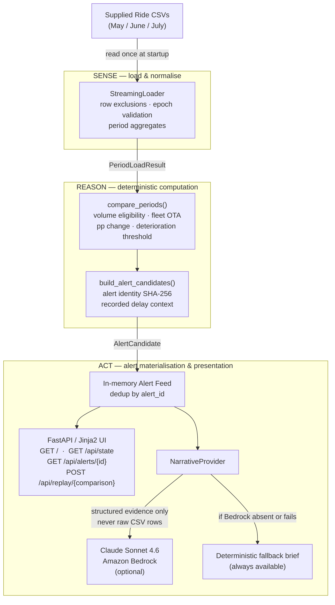

# OTA Watchdog

An agentic transport-operations watchdog that proactively detects material vendor OTA deterioration, grounds every alert in deterministic evidence, and uses Claude on Amazon Bedrock only to convert evidence into an operational brief.

---

## Problem

Transport Managers overseeing fleets of vendors need to identify which vendors are genuinely deteriorating in on-time arrival — but assembling the evidence manually (pulling monthly ride data, filtering for volume, computing OTA, comparing against the fleet baseline, surfacing delay-reason context) takes more time than acting on the result.

Without a proactive system, deterioration is often discovered late, evidence is assembled inconsistently, and briefings mix recorded data with interpretation.

OTA Watchdog automates the evidence pipeline end-to-end, surfacing deterministic alerts the moment a replay cycle runs, and optionally generating an LLM operational brief from the assembled evidence — without delegating any threshold-crossing decision to the model.

---

## What the solution does

### SENSE
- Loads supplied monthly ride-log CSV data once at startup
- Applies documented exclusions: SPOT_2.0 rows (unestablished semantics) and rows with missing/invalid epoch timestamps
- Aggregates per-vendor, per-period OTA counts

### REASON
- Computes OTA: `actual_end_epoch ≤ planned_end_epoch + T_SECONDS` per trip
- Applies minimum-volume filter: only vendors with ≥ `VOL_MIN` trips in both periods are eligible
- Computes fleet-level OTA context across all eligible vendors
- Applies deterioration threshold: vendor crosses the configured threshold if `current_OTA − prior_OTA < −DETERIORATION_THRESHOLD_PP`
- Surfaces recorded delay-reason distribution as contextual evidence (non-causal)

### ACT
- Materialises deterministic `AlertCandidate` objects into an in-memory feed, deduped by content-based SHA-256 identity
- Generates an optional Claude operational brief from the structured evidence
- Never delegates threshold-crossing calculation, OTA computation, or threshold evaluation to the LLM

---

## Demo policy

| Parameter | Value |
|---|---|
| OTA tolerance | 5 minutes (`T_SECONDS = 300`) |
| Minimum volume | 500 trips per vendor per period |
| Deterioration trigger | > 5 percentage-point OTA decline |

> **These are product/demo defaults, not contractual SLA values.**

---

## Key demo result

### May → June

| Metric | Value |
|---|---|
| Eligible vendors | 21 |
| Deterioration alerts | 18 |
| Fleet OTA (May) | 46.98% |
| Fleet OTA (June) | 41.14% |
| Fleet change | −5.84 pts |

**Primary example — Meera Pavlov Travel**

| Field | Value |
|---|---|
| OTA (May) | 76.39% |
| OTA (June) | 68.53% |
| Change | −7.86 pts |
| Prior trips | 5,392 |
| Current trips | 5,294 |

Recorded current-period delay context (contextual, not causal):

| Reason | Count | Share of late trips |
|---|---|---|
| NODELAY | 1,518 | 91.1% |
| TRAFFIC | 97 | 5.8% (top non-NODELAY) |
| Total late | 1,666 | — |

> NODELAY is the most frequent recorded delay-reason label for this example; its operational meaning is not established by the supplied data.

### June → July

| Metric | Value |
|---|---|
| Eligible vendors | 21 |
| Deterioration alerts | 0 |

No eligible vendor crossed the configured deterioration threshold. The zero-alert state is a legitimate outcome, not a system error.

---

## Architecture



> Bedrock receives only the structured deterministic evidence fields from `AlertCandidate` — not raw CSV rows, not trip-level records.

---

## Deterministic vs AI responsibilities

| Responsibility | Owner |
|---|---|
| Data exclusions (SPOT_2.0, null epoch) | Deterministic engine |
| OTA calculation | Deterministic engine |
| Volume eligibility | Deterministic engine |
| Fleet OTA context | Deterministic engine |
| Deterioration rule | Deterministic engine |
| Alert identity (SHA-256) | Deterministic engine |
| All evidence values | Deterministic engine |
| Concise operational narrative | Claude (optional) |
| Suggested investigation wording | Claude (optional) |

Claude **must not**:
- Calculate OTA or derive new metrics
- Determine threshold-crossing status
- Infer causality from delay reason codes
- Fabricate evidence not present in the alert
- Alter any deterministic value

---

## Data handling

- Raw supplied dataset remains local and is gitignored
- Raw CSVs are immutable and read-only; the application never writes to them
- Ride monthly files (May, June, July 2026) are the data source for this MVP
- SPOT_2.0 rows are excluded because their trip semantics were not established for this dataset
- Rows with missing or invalid epoch timestamps are explicitly excluded and counted in the load report
- Recorded delay reason is included as contextual evidence only — it is not a causal determination
- Raw CSV records are never transmitted to Bedrock; only pre-aggregated evidence fields are sent

---

## Quick start

```powershell
python -m pip install -e ".[dev]"
```

**Deterministic mode (no AWS required):**

```powershell
python -m uvicorn moveinsync_ota.app.main:app --port 8001
```

Open `http://localhost:8001`. The May → June cycle runs automatically at startup. Without `BEDROCK_MODEL_ID` set, the deterministic fallback narrative is used automatically — the application is fully functional.

---

## Amazon Bedrock / Claude Sonnet 4.6

Set environment variables (no credentials in code or config files):

```powershell
$env:AWS_PROFILE        = "<your-profile>"
$env:AWS_REGION         = "ap-south-1"
$env:AWS_DEFAULT_REGION = "ap-south-1"
$env:BEDROCK_MODEL_ID   = "global.anthropic.claude-sonnet-4-6"
```

Then start the application:

```powershell
python -m uvicorn moveinsync_ota.app.main:app --port 8001
```

The Bedrock path is tried lazily when an alert detail is opened. Any failure (auth, throttle, unreachable endpoint) falls back transparently to the deterministic brief.

> **Never commit AWS credentials, access keys, or session tokens.**

See `.env.example` for the full variable reference.

---

## Demo flow

*2-minute judge demo*

1. **Open** `http://localhost:8001`. The May → June agent cycle completed at startup.
2. **Point to the run summary:** SENSE → REASON → ACT phases complete, 21 eligible vendors.
3. **Explain:** "The agent loaded three months of anonymised ride data, computed OTA for every vendor with 500+ trips, compared May to June against a 5 percentage-point threshold, and materialised 18 alerts."
4. **Show metrics bar:** 18 deteriorations, fleet OTA 46.98% → 41.14% (−5.84 pts).
5. **Click Meera Pavlov Travel.** Modal opens with deterministic evidence.
6. **Vendor Evidence:** Prior 76.39% → Current 68.53%, change −7.86 pts, 5,294 trips.
7. **Fleet Context:** Fleet moved down 5.84 percentage points; 18 of 21 vendors crossed the configured deterioration threshold.
8. **Recorded Delay Context:** 1,666 late trips, 91.1% were labeled NODELAY — surface as recorded context, not a causal explanation.
9. **Operational Brief:** Claude summarised the evidence. "The model was given only structured evidence fields — it cannot alter the alert or determine threshold-crossing status."
10. **Switch to June → July, click Run Agent Cycle.** Zero alerts. "All 21 vendors maintained OTA — the system doesn't force alerts when none exist."

---

## API

| Method | Path | Description |
|---|---|---|
| `GET` | `/` | Single-page web UI |
| `GET` | `/api/state` | Current run, comparison, and candidate feed for all supported pairs |
| `GET` | `/api/alerts/{alert_id}` | Full deterministic evidence + optional narrative for one alert |
| `POST` | `/api/replay/{comparison}` | Run SENSE→REASON→ACT cycle for a comparison pair |

**Supported comparisons:** `may-june`, `june-july`

---

## Tests

```powershell
python -m pytest -q
```

**254 tests passing** across data loading, OTA computation, alert evidence assembly, service layer, narrative provider, and API smoke tests (unit + integration against the real dataset).

---

## Project structure

```
src/moveinsync_ota/
├── config.py               # T_SECONDS, VOL_MIN, thresholds, data paths
├── data/
│   ├── loader.py           # streaming CSV loader, exclusions, aggregation
│   ├── normalise.py        # epoch and delay-reason normalisation
│   └── schema.py           # PeriodLoadResult, VendorPeriodAgg
├── compute/
│   └── comparison.py       # compare_periods(), PeriodComparison
├── alerts/
│   ├── builder.py          # build_alert_candidates(), alert identity SHA-256
│   └── models.py           # AlertCandidate
└── app/
    ├── service.py          # OTAService, AgentRun, SUPPORTED_COMPARISONS
    ├── narrative.py        # NarrativeProvider, Deterministic, Bedrock providers
    ├── main.py             # FastAPI app, routes, lifespan
    ├── templates/
    │   └── index.html
    └── static/
        ├── app.css
        └── app.js

tests/                      # 254 tests
input/dataset/raw/          # gitignored — supplied CSV files
docs/                       # ARCHITECTURE.md, DEMO_SCRIPT.md, SAMPLE_OUTPUT.md
```

---

## Scope and limitations

- Static anonymised challenge dataset — not a live operational feed
- Replay/scheduled-agent simulation, not real-time stream processing
- Actions are in-app only — no external vendor notification
- No production authentication or multi-tenancy
- No causal interpretation of recorded delay reason codes
- Demo policy (5 min / 500 trips / 5 percentage points) is not a contractual SLA
- No independent user validation of alert thresholds has been performed

---

## Future production path

- Scheduled ingestion from live operational feeds with incremental period updates
- Tenant isolation, authentication, and role-based access control
- Persistent alert and run history with audit trail
- External notification and workflow integrations (email, ticketing, Slack)
- Configurable policy parameters per tenant with observability dashboards
