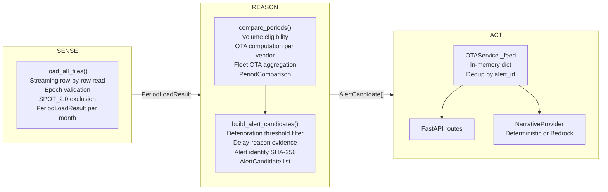

# OTA Watchdog — Architecture

## System context

OTA Watchdog is a single-process Python application. It loads three months of anonymised ride-log CSV data once at startup, runs a deterministic OTA pipeline, and serves a FastAPI web UI with optional Claude/Bedrock narrative generation.

The core design principle: **every threshold-crossing decision is made deterministically**. The LLM is restricted to converting pre-computed evidence into a human-readable operational brief.

---

## SENSE → REASON → ACT lifecycle



**SENSE** runs inside `OTAService.load()`, called once in the FastAPI `lifespan`. Subsequent replays reuse the already-loaded `_periods` dict — no CSV re-reads.

**REASON** runs inside `OTAService.replay()`. It calls the committed M1/M2/M3 pipeline directly — `compare_periods()` then `build_alert_candidates()`. No OTA math is in the web layer.

**ACT** materialises alerts. `_feed[alert_id] = candidate` is idempotent on repeated replay of the same data.

---

## Deterministic evidence boundary

The web layer (`app/`) is strictly a consumer of M1/M2/M3 output. It:

- reads `PeriodLoadResult`, `PeriodComparison`, `AlertCandidate` fields
- rounds numbers for display only
- never recomputes OTA, fleet aggregates, or threshold checks
- never modifies candidate objects

`_card_dict()` and `_detail_dict()` in `main.py` are pure projections of `AlertCandidate` fields.

---

## Bedrock role and fallback

```
NarrativeProvider (ABC)
    ├── DeterministicNarrativeProvider   ← always works, no external dependency
    └── BedrockNarrativeProvider         ← wraps Converse API; any exception → fallback
```

`BedrockNarrativeProvider`:
- constructed only when `BEDROCK_MODEL_ID` env var is set
- sends only pre-computed `AlertCandidate` evidence fields — not raw CSV rows
- uses the Bedrock Converse API with `maxTokens=400, temperature=0.3`
- the prompt explicitly forbids recalculation, causal claims, ranking language, and invented numbers
- on any exception (auth, throttle, model error, network), logs a warning and returns the deterministic brief
- `GET /api/alerts/{id}` always succeeds regardless of Bedrock availability

Narrative is generated lazily and cached by `alert_id` within the process. Same alert opened multiple times invokes the provider once.

---

## Data flow

```
CSV files (immutable, gitignored)
    │
    ▼
load_all_files(DATA_DIR, MONTH_FILES, T_SECONDS)
    │  row → epoch normalise → OTA flag → vendor agg
    │
    ▼  PeriodLoadResult  (one per month)
OTAService._periods dict
    │
    ▼  on replay(comparison_key)
compare_periods(prior, current, VOL_MIN, DETERIORATION_THRESHOLD_PP)
    │  → PeriodComparison  (fleet stats, breach list, provenance)
    │
    ▼
build_alert_candidates(comparison)
    │  → [AlertCandidate]  (one per breaching vendor)
    │
    ▼
OTAService._feed[alert_id] = candidate      ← dedup by SHA-256 identity
OTAService._candidates[comparison_key]      ← replace list each replay
OTAService._runs.append(AgentRun)           ← history per comparison
```

---

## Alert idempotency

Alert identity is a SHA-256 of a canonical JSON object containing vendor ID, both period names, and all three policy parameters. Keys are sorted; separators are `(',', ':')`. Timestamps and run IDs are not part of the identity.

Replaying the same comparison with the same data and policy always produces the same alert IDs. `_feed[alert_id] = candidate` ensures no growth on repeated replay.

---

## Configuration provenance

Policy parameters flow from source to alert identity without intermediate mutation:

```
config.py (T_SECONDS, VOL_MIN, DETERIORATION_THRESHOLD_PP)
    → PeriodLoadResult.t_seconds
    → PeriodComparison.{t_seconds, vol_min, deterioration_threshold_pp}
    → AlertCandidate.{T_seconds, vol_min, deterioration_threshold_pp}
    → alert identity SHA-256
```

A mismatch in `t_seconds` between two periods raises `ValueError` in `compare_periods()` before any alerts are generated.

---

## Why no LLM is involved in threshold-crossing calculation

The threshold-crossing determination is a threshold comparison on deterministic numbers. Delegating it to an LLM would:

- make the threshold crossing non-reproducible (temperature > 0, prompt variation)
- make the evidence non-auditable
- introduce hallucination risk on numerical data

The LLM is introduced only after the threshold-crossing decision is final, to convert a structured evidence block into a paragraph. The paragraph cannot retroactively alter the alert identity, the OTA values, or the threshold-crossing status.

---

## Key files

| File | Role |
|---|---|
| `config.py` | Single source of truth for T_SECONDS, VOL_MIN, thresholds, data paths |
| `data/loader.py` | Streaming CSV loader; exclusions; PeriodLoadResult assembly |
| `compute/comparison.py` | `compare_periods()`, provenance validation, PeriodComparison |
| `alerts/builder.py` | `build_alert_candidates()`, alert identity SHA-256 |
| `alerts/models.py` | `AlertCandidate` dataclass |
| `app/service.py` | `OTAService`, `AgentRun`, feed dedup |
| `app/narrative.py` | `NarrativeProvider` ABC, deterministic and Bedrock providers |
| `app/main.py` | FastAPI lifespan, routes, serialisation helpers |
